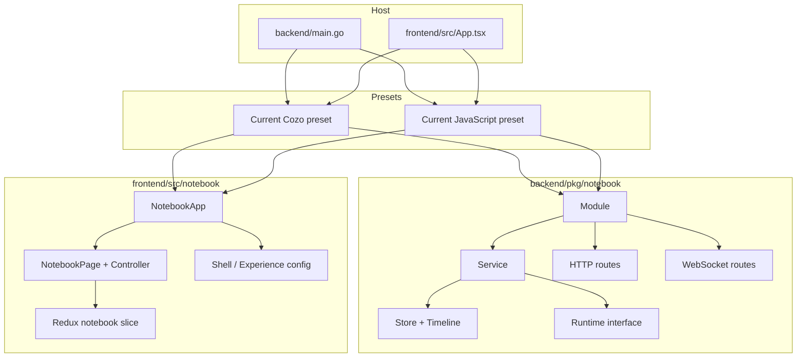
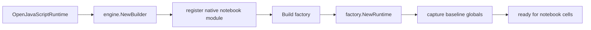

# JavaScript notebook preset postmortem and intern analysis

## Executive Summary

This document explains the completed JavaScript notebook preset from two angles at once:

- what the system is now
- what we learned while building it

If you are a new intern, the most important idea to internalize is this: the JavaScript preset is not a second app. It is a second **preset family** built on top of one shared notebook package. That package spans both backend and frontend:

- shared backend notebook module in [backend/pkg/notebook](/home/manuel/code/wesen/2026-03-14--cozodb-editor/backend/pkg/notebook)
- shared frontend notebook module in [frontend/src/notebook](/home/manuel/code/wesen/2026-03-14--cozodb-editor/frontend/src/notebook)

The JavaScript preset only became clean to implement after one architectural correction: the shared backend runtime seam had to stop returning Cozo types. That refactor looks small in code, but it is the reason the rest of the implementation stayed coherent.

The end result is a working vertical slice:

- backend preset selection in [backend/main.go](/home/manuel/code/wesen/2026-03-14--cozodb-editor/backend/main.go)
- Goja-backed runtime manager in [javascript_runtime.go](/home/manuel/code/wesen/2026-03-14--cozodb-editor/backend/pkg/notebook/javascript_runtime.go)
- backend JavaScript preset constructor in [current_javascript.go](/home/manuel/code/wesen/2026-03-14--cozodb-editor/backend/pkg/notebook/current_javascript.go)
- frontend JavaScript preset wrapper in [currentJavaScript.tsx](/home/manuel/code/wesen/2026-03-14--cozodb-editor/frontend/src/notebook/currentJavaScript.tsx)
- Storybook and MSW validation for the new preset

This postmortem focuses on the architecture, the ordering constraints, the failure modes, and the parts of the design that are likely to matter again when the next preset or feature set is added.

## Problem Statement

Before `COZODB-014`, the repository had already done a lot of decomposition work:

- the frontend notebook page had been split into reusable view/controller pieces
- Storybook and MSW had been added for isolated validation
- the backend notebook module owned REST and WebSocket mounting
- the current Cozo app had been reframed as a preset rather than as the only app shape

That was necessary, but not sufficient.

The key unresolved problem was that the backend notebook runtime contract was still effectively saying:

```go
type Runtime interface {
    Query(...) (*cozo.QueryResult, error)
    DescribeRelation(...) (*cozo.RelationInfo, error)
}
```

That means the generic notebook package still knew too much about Cozo.

Why is that bad?

- A second preset would have to fake Cozo-shaped data.
- Naming and semantics would drift apart.
- Reviews would get harder because the code would be lying about what it represented.
- Every later preset would accumulate more adapter sludge.

On the frontend side, the situation was better, but there was still one conceptual leak: some shared notebook surfaces still depended on a Cozo-named sem-handler file. That is less severe than returning Cozo types from the backend contract, but it is the same class of problem.

So the real problem was not "we do not have JavaScript execution yet."

The real problem was:

> Can this repository support a second notebook preset without forking the system or lying about the abstraction?

`COZODB-014` exists because that question needed a code answer, not a diagram answer.

## Proposed Solution

The implementation used one shared principle everywhere:

> Keep shared seams honest, and move preset-specific behavior behind preset-owned wrappers.

That principle produced four concrete moves.

### 1. Make the backend runtime contract notebook-owned

Instead of returning Cozo types, the notebook package now defines its own runtime result and relation structures in [runtime.go](/home/manuel/code/wesen/2026-03-14--cozodb-editor/backend/pkg/notebook/runtime.go).

This is the conceptual center of the entire ticket.

```go
type RuntimeQueryResult struct {
    OK      bool
    Headers []string
    Rows    [][]any
    Took    float64
    Code    string
    Message string
    Display string
}

type RuntimeRelationInfo struct {
    Name   string
    Keys   []RuntimeColumnInfo
    Values []RuntimeColumnInfo
}
```

The names still keep some old Cozo flavor such as `Relation`, because renaming the whole public shape was not necessary for this ticket. The crucial improvement is that the types are now notebook-owned and preset-neutral.

### 2. Adapt Cozo to the shared seam instead of extending Cozo semantics

The Cozo preset now uses [cozo_runtime.go](/home/manuel/code/wesen/2026-03-14--cozodb-editor/backend/pkg/notebook/cozo_runtime.go) as a small translation adapter.

That sounds mundane, but this move establishes the rule for future presets:

- shared package owns the contract
- preset-specific runtime adapts behind it

### 3. Add a Goja runtime manager that fits the notebook contract

The JavaScript runtime manager in [javascript_runtime.go](/home/manuel/code/wesen/2026-03-14--cozodb-editor/backend/pkg/notebook/javascript_runtime.go) uses the explicit `go-go-goja` factory/runtime lifecycle from [factory.go](/home/manuel/code/wesen/corporate-headquarters/go-go-goja/engine/factory.go).

It does five jobs:

- create owned Goja runtimes
- execute notebook cell source safely through `Owner.Call(...)`
- shape returned JS values into notebook tables
- expose a small schema/listing surface for hints and host APIs
- swap owned runtimes on reset

### 4. Add a sibling frontend preset, not a second page

The frontend JavaScript preset did not copy [NotebookApp.tsx](/home/manuel/code/wesen/2026-03-14--cozodb-editor/frontend/src/notebook/NotebookApp.tsx) or [NotebookPage.tsx](/home/manuel/code/wesen/2026-03-14--cozodb-editor/frontend/src/notebook/NotebookPage.tsx).

Instead, it introduced:

- [currentJavaScriptConfig.ts](/home/manuel/code/wesen/2026-03-14--cozodb-editor/frontend/src/notebook/currentJavaScriptConfig.ts)
- [currentJavaScript.tsx](/home/manuel/code/wesen/2026-03-14--cozodb-editor/frontend/src/notebook/currentJavaScript.tsx)
- JS-specific Storybook stories and MSW fixtures

This is exactly the proof we wanted:

- same shared notebook page
- same shared Redux slice
- same shared CSS
- different preset config and wrapper

## System Overview For An Intern

### The simplest mental model

Treat the project as three layers:

1. the **shared notebook engine**
2. the **preset wrappers**
3. the **host app entrypoints**

```text
shared notebook package
├── backend/pkg/notebook
│   ├── store + timeline
│   ├── service
│   ├── http + websocket adapters
│   └── runtime interface
└── frontend/src/notebook
    ├── page + state + views
    ├── shell/experience config
    └── preset registration points

presets
├── current Cozo
└── current JavaScript

hosts
├── backend/main.go --preset ...
└── frontend/src/App.tsx via VITE_NOTEBOOK_PRESET
```

### Architecture diagram



### What files matter first

If you are onboarding, read in this order:

1. [backend/pkg/notebook/runtime.go](/home/manuel/code/wesen/2026-03-14--cozodb-editor/backend/pkg/notebook/runtime.go)
2. [backend/pkg/notebook/service.go](/home/manuel/code/wesen/2026-03-14--cozodb-editor/backend/pkg/notebook/service.go)
3. [backend/pkg/notebook/current_cozo.go](/home/manuel/code/wesen/2026-03-14--cozodb-editor/backend/pkg/notebook/current_cozo.go)
4. [backend/pkg/notebook/current_javascript.go](/home/manuel/code/wesen/2026-03-14--cozodb-editor/backend/pkg/notebook/current_javascript.go)
5. [backend/pkg/notebook/javascript_runtime.go](/home/manuel/code/wesen/2026-03-14--cozodb-editor/backend/pkg/notebook/javascript_runtime.go)
6. [frontend/src/notebook/NotebookApp.tsx](/home/manuel/code/wesen/2026-03-14--cozodb-editor/frontend/src/notebook/NotebookApp.tsx)
7. [frontend/src/notebook/useNotebookPageController.ts](/home/manuel/code/wesen/2026-03-14--cozodb-editor/frontend/src/notebook/useNotebookPageController.ts)
8. [frontend/src/notebook/currentCozo.tsx](/home/manuel/code/wesen/2026-03-14--cozodb-editor/frontend/src/notebook/currentCozo.tsx)
9. [frontend/src/notebook/currentJavaScript.tsx](/home/manuel/code/wesen/2026-03-14--cozodb-editor/frontend/src/notebook/currentJavaScript.tsx)

## Backend Deep Dive

### Shared notebook backend

The shared backend notebook module does not care whether the runtime is Cozo or JavaScript. It expects a runtime that can do five things:

- execute code
- list runtime objects
- describe one runtime object
- return a schema-like summary string
- reset itself

Everything else in the notebook backend is language-agnostic:

- notebook persistence
- notebook cell order
- run records
- timeline snapshots
- HTTP routes
- WebSocket hint/diagnosis transport

That means the runtime is a plug-in point inside a larger workflow, not the whole workflow.

### JavaScript runtime execution flow

The Goja runtime manager uses the explicit factory pattern from `go-go-goja`.



Cell execution then looks like this:

```pseudocode
Query(script, params):
    lock runtime for reading
    start timer
    result = runtime.Owner.Call(ctx, "query", fn(vm):
        vm.Set("__notebookParams", params)
        value = vm.RunString(script)
        return exportGojaValue(value)
    )
    headers, rows = shapeJavaScriptValueForNotebook(result)
    return RuntimeQueryResult{
        OK: true,
        Headers: headers,
        Rows: rows,
        Took: elapsedSeconds,
    }
```

Key detail:

- execution uses `Owner.Call(...)`, not unsynchronized `VM.RunString(...)` from arbitrary goroutines

That matters because the runtime is an owned resource with an event loop. The whole point of using `go-go-goja` here is to respect that lifecycle instead of improvising around it.

### Value shaping rules

JavaScript values do not naturally come out in notebook-table form. The shaping logic in [javascript_runtime.go](/home/manuel/code/wesen/2026-03-14--cozodb-editor/backend/pkg/notebook/javascript_runtime.go) turns them into a stable output shape that the existing frontend already knows how to render.

Current rules:

- `nil` / undefined-like value → one-column table with `"undefined"`
- array of objects → headers from merged object keys, rows from values
- array of arrays with consistent width → `col_1`, `col_2`, ...
- plain object → two-column `key`, `value` table
- primitive → one-column `value` table
- nested objects or arrays inside cells → JSON stringified

This is a deliberate tradeoff.

Good:

- no frontend output refactor needed
- most normal notebook values are readable immediately

Limitations:

- rich nested values are flattened into strings
- there is no special visualization for promises, functions, or custom classes
- success output still uses a table metaphor even when a richer renderer might be nicer

### Reset flow

Reset is one of the most important operations because notebook state persists across cells.

```pseudocode
Reset():
    lock runtime for writing
    nextRuntime = factory.NewRuntime()
    baselineGlobals = snapshot(nextRuntime.globalObject.keys)
    previous = currentRuntime
    currentRuntime = nextRuntime
    generation += 1
    previous.Close()
    return generation
```

Why rebuild instead of mutating in place?

- simpler correctness model
- no hidden leftovers from previous cells
- aligns with the explicit owned-runtime lifecycle from `go-go-goja`

### Schema and object listing

The notebook package still has some Cozo-shaped method names such as `ListRelations()` and `DescribeRelation()`. In the JavaScript preset they now mean:

- `ListRelations()` → list preset-owned modules plus `globalThis`-visible user objects
- `DescribeRelation(name)` → describe one module or one global object

This naming is still imperfect. It is acceptable for now because:

- the type contract is now honest
- the semantics are documented
- a later cleanup can rename the methods once both presets are stable

## Frontend Deep Dive

### Shared frontend notebook package

The frontend shared package already existed before `COZODB-014`, and that is why the JavaScript frontend work was relatively clean.

The shared pieces include:

- page controller in [useNotebookPageController.ts](/home/manuel/code/wesen/2026-03-14--cozodb-editor/frontend/src/notebook/useNotebookPageController.ts)
- shared page wrapper in [NotebookApp.tsx](/home/manuel/code/wesen/2026-03-14--cozodb-editor/frontend/src/notebook/NotebookApp.tsx)
- shared Redux notebook state in [notebookSlice.ts](/home/manuel/code/wesen/2026-03-14--cozodb-editor/frontend/src/notebook/state/notebookSlice.ts)
- shared experience config in [experienceConfig.ts](/home/manuel/code/wesen/2026-03-14--cozodb-editor/frontend/src/notebook/experienceConfig.ts)

### Why `semHandlers.ts` mattered

Before this ticket, the sem handler type for the shared notebook page lived in a Cozo-specific file. That is a small naming leak, but it matters because shared notebook code starts depending on the wrong conceptual owner.

The new [semHandlers.ts](/home/manuel/code/wesen/2026-03-14--cozodb-editor/frontend/src/notebook/semHandlers.ts) fixes that:

- generic type lives in a generic file
- default notebook behavior is generic
- Cozo-specific handler registration stays in [registerCurrentCozoSemHandlers.ts](/home/manuel/code/wesen/2026-03-14--cozodb-editor/frontend/src/notebook/registerCurrentCozoSemHandlers.ts)

This is a good example of the kind of small cleanup that keeps a multi-preset architecture from drifting back into app-specific coupling.

### Preset composition on the frontend

The JavaScript preset wrapper in [currentJavaScript.tsx](/home/manuel/code/wesen/2026-03-14--cozodb-editor/frontend/src/notebook/currentJavaScript.tsx) mirrors the Cozo wrapper shape very closely.

That is a feature, not a lack of imagination.

It means the preset boundary is stable enough that both families fit the same composition pattern:

```pseudocode
CurrentJavaScriptNotebookApp():
    create store with notebook transport
    open shared NotebookApp
    pass JavaScript shell config
    pass JavaScript experience config
    pass default notebook sem handlers
    pass hints websocket
```

The main differences are:

- shell title and menu defaults
- placeholder text
- code fence language
- sem handler choice

### Storybook and MSW

This ticket deliberately treated Storybook as a validation environment, not just a UI showcase.

The JavaScript preset uses:

- [CurrentJavaScriptNotebookApp.stories.tsx](/home/manuel/code/wesen/2026-03-14--cozodb-editor/frontend/src/notebook/CurrentJavaScriptNotebookApp.stories.tsx)
- JavaScript fixtures and runtime mocking in [notebookApiHandlers.ts](/home/manuel/code/wesen/2026-03-14--cozodb-editor/frontend/src/storybook/notebookApiHandlers.ts)
- an embedded JS host story in [NotebookApp.stories.tsx](/home/manuel/code/wesen/2026-03-14--cozodb-editor/frontend/src/notebook/NotebookApp.stories.tsx)

This lets us test:

- preset wrapper works standalone
- shared notebook package works when embedded in another host
- CSS still looks coherent
- MSW-backed interactive flows still behave as expected

## What Went Right

### 1. The work was sequenced correctly

This ticket benefited from the work done in `COZODB-011`, `COZODB-012`, and `COZODB-013`, but it still had one critical sequencing decision inside it:

- first, clean the shared runtime seam
- then, add the Goja runtime
- then, add the frontend sibling preset

If we had skipped the first step, the whole ticket would have turned into a compatibility workaround.

### 2. The shared package boundaries were real

The frontend did not need a second page.
The backend did not need a second notebook module.

That is the best possible outcome of the earlier packaging work.

### 3. `go-go-goja` was a good fit

The explicit builder/factory/runtime lifecycle matched the resettable notebook model well:

- explicit runtime ownership
- runtime module registration
- clean close behavior
- clear place to add more preset-native modules later

## What Went Wrong

### 1. The original backend runtime seam was still too Cozo-shaped

This was not a failure inside `COZODB-014`, but it was the biggest leftover design debt that `COZODB-014` had to pay off before it could move forward.

Lesson:

- packaging work is only done when the central contract is honest

### 2. JavaScript scope semantics were easy to misread

Top-level `const` bindings persist between evaluations, but they do not automatically show up as enumerable `globalThis` properties.

That caused early test failures when the code assumed this:

```javascript
const users = [...]
users
```

would also make `users` appear in the runtime object listing.

It does not.

Lesson:

- separate the concept of "cell execution persistence" from "introspectable runtime globals"

### 3. Shared frontend code still had a Cozo-named type leak

The sem handler registrar type living in a Cozo-specific file was not catastrophic, but it was exactly the kind of leak that becomes annoying once a second preset arrives.

Lesson:

- naming leaks are real architectural leaks when shared code starts depending on them

### 4. Tooling muscle memory caused one avoidable validation detour

I initially ran:

```bash
npm test -- --runInBand
```

That failed because this repo uses Vitest, not Jest.

Lesson:

- always validate using repo-native commands, not remembered commands from another stack

## Failure Modes And Sharp Edges

### Runtime shaping is useful but opinionated

If a future preset or future JS feature wants richer result rendering, the current table-shaping logic may become a bottleneck.

Warning signs:

- lots of JSON-stringified nested values
- need for async result or promise visualization
- need to render functions or structured errors differently

### The `/api/schema` surface is semantically stretched

It still works, but its naming came from Cozo.

Today it is good enough for:

- schema-ish introspection
- AI hints context
- lightweight preset debugging

It is not yet a polished cross-language introspection API.

### Default module exposure is intentionally conservative

The JavaScript preset does **not** expose every possible `go-go-goja` default module by default.

That was intentional because:

- more modules means more surface area
- more surface area means more semantics to document and test
- this ticket's goal was preset proof, not module abundance

## Design Decisions

### Decision: keep one notebook package

Reason:

- the whole packaging effort was about preset composition, not per-language forks

### Decision: adapt Cozo behind notebook-owned types

Reason:

- shared package should own the shared vocabulary

### Decision: use Goja factory/runtime lifecycle explicitly

Reason:

- aligns with the runtime owner model
- makes reset implementation natural

### Decision: treat `globalThis` visibility as the schema/listing promise

Reason:

- it is reliable
- it avoids fake introspection claims

### Decision: keep frontend CSS shared

Reason:

- the visual shell should stay generic unless a preset genuinely needs a different visual system

## Alternatives Considered

### Alternative: fork the notebook page for JavaScript

Rejected because it would have invalidated the package boundary.

### Alternative: return `cozo.QueryResult` forever and fake JavaScript results into it

Rejected because it would turn the shared contract into a lie.

### Alternative: expose the whole default Goja module registry immediately

Rejected because it increases surface area without proving the preset architecture any better.

### Alternative: build a richer JavaScript renderer first

Rejected because the ticket first needed to prove:

- execution
- reset
- preset wrapping
- shared shell reuse

## API Reference Snapshot

### Backend preset constructor

```go
func OpenCurrentJavaScriptModule(config CurrentJavaScriptModuleConfig) (*Module, error)
```

Key fields:

- `AppDBPath`
- `EnableAI`
- `BasePaths`
- `Logf`

### Backend runtime manager

```go
func OpenJavaScriptRuntime(config JavaScriptRuntimeConfig) (*JavaScriptRuntime, error)
```

Current responsibilities:

- create runtime
- execute source
- shape results
- list runtime objects
- describe runtime objects
- reset
- close

### Frontend preset wrapper

```ts
export function CurrentJavaScriptNotebookApp(
  props: CurrentJavaScriptNotebookAppProps
): JSX.Element
```

Key props:

- `apiBase?`
- `confirmAction?`
- `shellConfig?`
- `store?`
- `ws?`
- `wsPath?`

### Frontend preset config

```ts
export const currentJavaScriptNotebookShellConfig: NotebookShellConfig
export const currentJavaScriptNotebookExperienceConfig: NotebookExperienceConfig
export function createCurrentJavaScriptNotebookStore(...)
```

## Validation And Review Checklist

Run these commands when reviewing or extending the preset:

```bash
cd /home/manuel/code/wesen/2026-03-14--cozodb-editor/backend
go test ./...

cd /home/manuel/code/wesen/2026-03-14--cozodb-editor/frontend
npm test
npm run lint
npx tsc --noEmit
npm run build
VITE_NOTEBOOK_PRESET=javascript npm run build
npm run build-storybook

cd /home/manuel/code/wesen/2026-03-14--cozodb-editor
docmgr doctor --ticket COZODB-014 --stale-after 30
```

Review questions:

- Does the new code live in shared notebook code or in a preset wrapper?
- Is the shared contract still honest, or is preset detail leaking into it?
- Does the runtime owner model remain respected?
- Does the frontend shared package stay preset-generic?
- Do Storybook fixtures prove isolation instead of only replaying the main app?

## Implementation Plan For The Next Intern

If you inherit this work, here is the safest order for any follow-up:

1. Read the files listed in the onboarding order above.
2. Decide whether your change belongs in:
   - shared notebook backend
   - shared notebook frontend
   - current Cozo preset
   - current JavaScript preset
3. If the change is preset-specific, keep it behind the preset wrapper/config first.
4. If the change seems shared, ask:
   - would both presets want this?
   - is the name still honest for both presets?
5. Add or update Storybook/MSW coverage before broadening the live app surface.
6. Run the full validation matrix.
7. Update the ticket docs if the change affects the architecture or preset promise.

## Open Questions

- Should JavaScript get a richer structured event vocabulary and dedicated thread renderer?
- Should `ListRelations()` / `DescribeRelation()` be renamed to a more neutral runtime object vocabulary?
- Should more `go-go-goja` modules be exposed to notebook cells by default?
- Should notebook outputs gain a non-table success renderer for richer JS values?

## Final Takeaway

The main lesson of this ticket is simple:

> Multi-preset systems succeed or fail on whether the shared contract tells the truth.

Everything else in `COZODB-014` followed from that.

Once the shared runtime seam was honest, the Goja runtime, the preset wrappers, the Storybook stories, and the preset-aware entrypoints all fit naturally. Without that first fix, every later line of code would have been compensating for the wrong abstraction.
