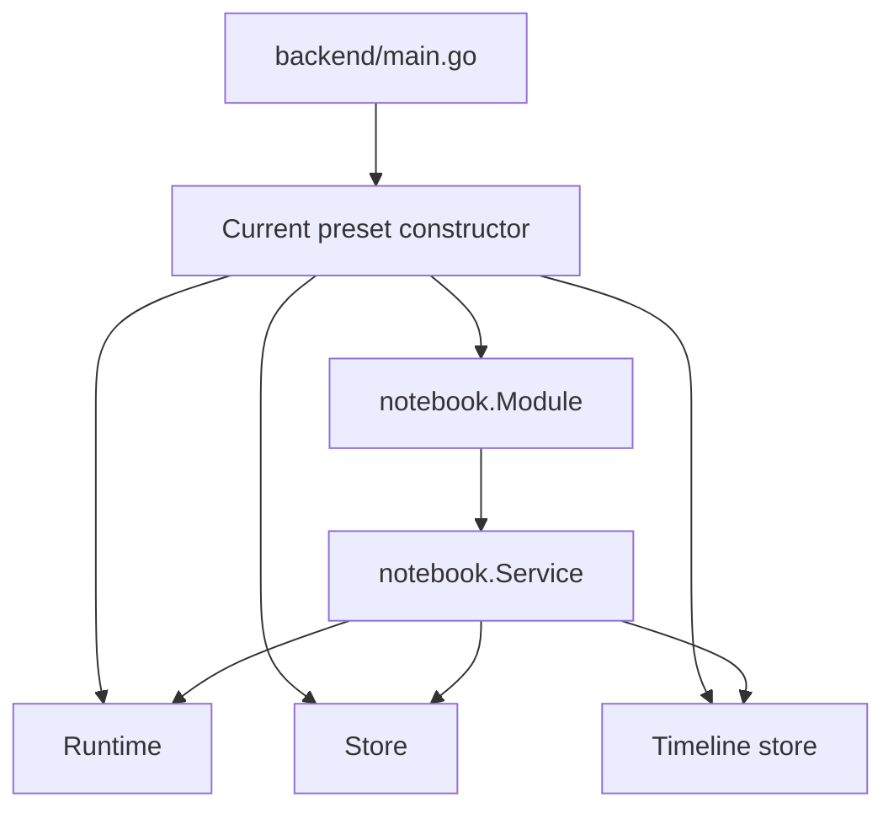
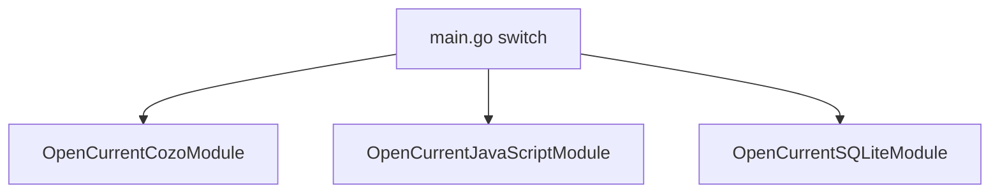
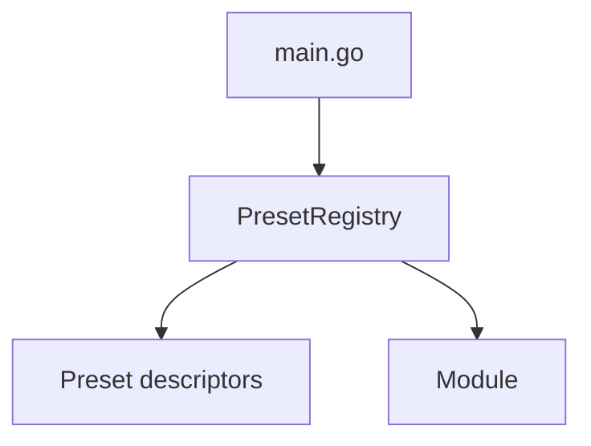
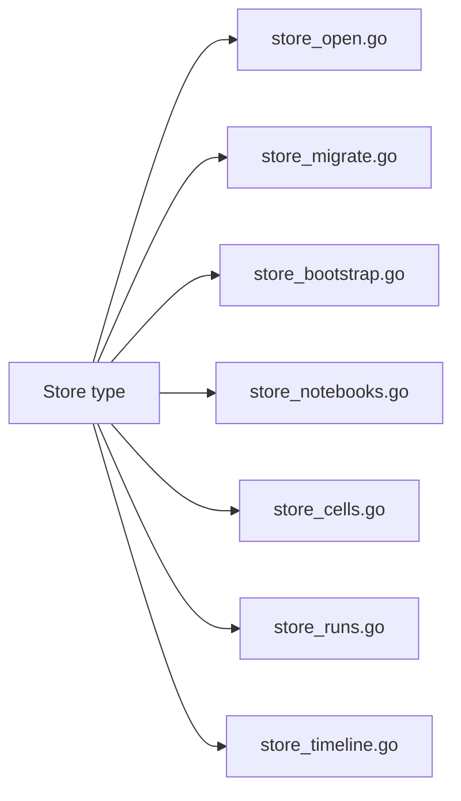

# Notebook store split and backend preset registry implementation guide

## Executive Summary

The notebook backend is now functionally richer than it was when the project started. It supports multiple presets, multiple runtimes, timeline persistence, notebook persistence, reset behavior, and transport ownership inside the notebook package. That progress is good, but it also produced two predictable code-shape problems:

- `backend/pkg/notebook/store.go` now owns too many responsibilities in one file
- `backend/main.go` still chooses presets through a hardcoded switch instead of a reusable registration mechanism

This ticket is the point where the project should pause and consolidate those backend seams before adding another preset or another persistence concern.

The proposed cleanup has two goals:

1. split `store.go` into responsibility-oriented files while keeping the same `Store` API
2. replace the hardcoded preset switch with a backend preset registry that can describe and open presets uniformly

This is not a cosmetic cleanup. It is a stability and extensibility cleanup.

## Problem Statement

The backend architecture is now good enough that its remaining rough edges are visible.

### Problem 1: `store.go` has become a concentration point

The store file currently contains:

- SQLite connection open/close behavior
- migration logic
- default notebook bootstrap logic
- notebook CRUD
- cell CRUD and ordering logic
- run persistence
- timeline snapshot persistence
- helper functions for starter cell IDs and dense ordering

That is too much to reason about in one file, even if the type itself remains a single `Store` struct.

This creates several concrete problems:

- a reader must scroll through unrelated concerns to find one method
- changes to notebook bootstrap and changes to run persistence feel artificially coupled because they live together
- test failures force the reader to understand a large file boundary before they can even classify the bug
- future refactors are more likely to become risky because everything is physically adjacent

### Problem 2: preset composition is still hand-wired

The backend currently opens presets like this in [backend/main.go](../../../../../../backend/main.go):

```go
switch *preset {
case "cozo":
    notebookModule, err = notebook.OpenCurrentCozoModule(...)
case "javascript":
    notebookModule, err = notebook.OpenCurrentJavaScriptModule(...)
case "sqlite":
    notebookModule, err = notebook.OpenCurrentSQLiteModule(...)
default:
    log.Fatalf("Unknown preset %q", *preset)
}
```

This was acceptable for the first few presets, but it now has visible drawbacks:

- the list of presets is duplicated in flag help and in the switch
- preset-specific option handling is spread across `main.go`
- adding a new preset means editing the entrypoint directly rather than registering a new backend preset in one place
- the system has no reusable object representing “a backend preset”

That means the backend is still partly in “if we have only three presets” mode, even though the rest of the project is increasingly organized around preset composition.

## Current System Overview

A new engineer should understand the current backend as four layers.

### 1. Host entrypoint

- [backend/main.go](../../../../../../backend/main.go)

This file:

- parses flags
- chooses a preset
- opens a notebook module
- mounts generic API handlers plus notebook-owned HTTP/WS handlers
- optionally proxies to Vite in development

### 2. Shared notebook module

- [backend/pkg/notebook/module.go](../../../../../../backend/pkg/notebook/module.go)
- [backend/pkg/notebook/service.go](../../../../../../backend/pkg/notebook/service.go)

This layer owns:

- notebook workflow
- service construction
- module close semantics
- route mounting

### 3. Preset constructors

- [backend/pkg/notebook/current_cozo.go](../../../../../../backend/pkg/notebook/current_cozo.go)
- [backend/pkg/notebook/current_javascript.go](../../../../../../backend/pkg/notebook/current_javascript.go)
- [backend/pkg/notebook/current_sqlite.go](../../../../../../backend/pkg/notebook/current_sqlite.go)

These files currently repeat the same composition pattern:

- open runtime
- optionally open AI engine
- build preset profile
- open store with profile
- open timeline store
- construct module
- register extra closers

### 4. Persistence layer

- [backend/pkg/notebook/store.go](../../../../../../backend/pkg/notebook/store.go)

This file persists:

- notebooks
- cells
- runs
- timeline snapshot links

It also owns migration and starter-cell/bootstrap behavior.

## Current Data Flow



The important observation is that the preset constructors are already conceptually a registry entry. They just are not modeled that way yet.

## Proposed Solution

The refactor should happen in two connected steps.

### Part A: Split `store.go` by responsibility

Keep one `Store` type, but move its methods into narrower files.

Recommended split:

- `store_open.go`
  - `StoreConfig`
  - `Store`
  - `OpenStore`
  - `OpenStoreWithConfig`
  - `Close`
  - `DBPath`
  - `DefaultNotebookID`
- `store_migrate.go`
  - `migrate`
- `store_bootstrap.go`
  - `EnsureDefaultNotebook`
  - starter/default notebook helper functions
- `store_notebooks.go`
  - notebook create/get/update methods
- `store_cells.go`
  - cell get/insert/update/move/delete methods
  - dense ordering helpers
- `store_runs.go`
  - run persistence and runtime state methods
- `store_timeline.go`
  - timeline snapshot link methods

This is a file split, not a type split.

Important rule:

- the `Store` public API should remain stable unless there is a compelling reason to change it

### Part B: Introduce a backend preset registry

Create a registry layer inside `backend/pkg/notebook` that can:

- register available backend presets
- expose preset names/descriptions
- open a preset module from normalized options

Possible shape:

```go
type PresetName string

type PresetOptions struct {
    AppDBPath         string
    EnableAI          bool
    BasePaths         BasePaths
    CozoEngine        string
    CozoDBPath        string
    SQLiteRuntimePath string
    Logf              func(format string, args ...any)
}

type PresetDescriptor struct {
    Name        PresetName
    Description string
    Open        func(options PresetOptions) (*Module, error)
}
```

Then add helpers like:

```go
func DefaultPresetRegistry() *PresetRegistry
func (r *PresetRegistry) Names() []string
func (r *PresetRegistry) Open(name string, options PresetOptions) (*Module, error)
```

`backend/main.go` should become a consumer of this registry rather than a hand-written switch.

## Why these two refactors belong together

These two cleanups are related because they are both about backend assembly boundaries.

The store split makes persistence internals easier to reason about.

The preset registry makes preset assembly easier to reason about.

Together they move the backend closer to this mental model:

```text
host chooses preset by name
registry opens preset module
module owns service
service uses store + runtime + timeline
store internals are decomposed by persistence concern
```

That is a better long-term shape than “large store file plus large host switch.”

## Detailed Design

### A. Store split design

Do not create multiple store structs. Do not create interfaces just to justify file splits. The design should stay simple:

- one `Store` type
- one SQLite connection field
- methods grouped by concern across files

Pseudocode:

```go
// store_open.go
type Store struct {
    db      *sql.DB
    dbPath  string
    profile NotebookProfile
}

// store_bootstrap.go
func (s *Store) EnsureDefaultNotebook(ctx context.Context) (*NotebookDocument, error)

// store_cells.go
func (s *Store) InsertCell(...)
func (s *Store) MoveCell(...)
func (s *Store) DeleteCell(...)

// store_runs.go
func (s *Store) UpsertCellRun(...)
func (s *Store) ClearRuntimeState(...)
```

This improves readability without changing ownership boundaries.

### B. Preset registry design

The registry should live near the preset constructors, not in `main.go`.

Recommended new files:

- `backend/pkg/notebook/preset_registry.go`
- optionally `backend/pkg/notebook/preset_options.go`

The default registry should register the three current presets:

- `cozo`
- `javascript`
- `sqlite`

`main.go` should ask the registry for:

- valid preset names for flag help or validation
- the opened preset module

Possible host flow:

```pseudocode
registry = notebook.DefaultPresetRegistry()

parse flags
options = notebook.PresetOptions{
    AppDBPath: appDBPath,
    EnableAI: env ANTHROPIC key exists,
    CozoEngine: engine,
    CozoDBPath: dbPath,
    SQLiteRuntimePath: sqliteRuntimePath,
    Logf: log.Printf,
}

module, err = registry.Open(presetName, options)
```

That means `main.go` only understands generic preset selection plus global host concerns.

## API Reference

### Current preset opener signatures

These are the current backend preset constructor shapes:

```go
func OpenCurrentCozoModule(config CurrentCozoModuleConfig) (*Module, error)
func OpenCurrentJavaScriptModule(config CurrentJavaScriptModuleConfig) (*Module, error)
func OpenCurrentSQLiteModule(config CurrentSQLiteModuleConfig) (*Module, error)
```

A registry layer should adapt to these existing constructors rather than rewriting them immediately.

### Proposed registry API

Suggested minimum API:

```go
type PresetRegistry struct { ... }

func DefaultPresetRegistry() *PresetRegistry
func (r *PresetRegistry) Names() []string
func (r *PresetRegistry) Open(name string, options PresetOptions) (*Module, error)
```

Optional but useful:

```go
func (r *PresetRegistry) Descriptors() []PresetDescriptor
func (r *PresetRegistry) MustOpen(name string, options PresetOptions) *Module
```

## Diagrams

### Current preset selection



### Proposed preset selection



### Proposed store decomposition



## Design Decisions

### 1. Split by responsibility, not by speculative abstraction

We do not need a `NotebookStore`, `CellStore`, and `RunStore` interface hierarchy. That would add conceptual overhead without solving the main readability problem.

The simpler design is:

- keep one store type
- split the file by concern

### 2. Introduce registry before adding another preset

The project could technically add a fourth preset by extending the current switch. That would be a mistake. The backend now has enough repeated preset assembly that the registry abstraction is already justified.

### 3. Preserve behavior first, simplify shape second

This ticket should not try to redesign store semantics, runtime semantics, or transport semantics at the same time.

The sequence should be:

- preserve behavior
- improve file boundaries
- improve preset selection boundary

### 4. Keep the current preset constructor files initially

The registry should wrap the existing `OpenCurrent*Module` functions first. If later work wants to rename them or normalize them further, that can happen after the registry exists.

## Alternatives Considered

### Alternative 1: Leave `store.go` as-is

Rejected.

Why:

- the file is already large enough to slow comprehension
- future preset or persistence work will make it worse

### Alternative 2: Replace the store with multiple store structs

Rejected for now.

Why:

- too much behavioral churn for a cleanup ticket
- likely to ripple across service tests and module construction unnecessarily

### Alternative 3: Keep the switch in `main.go` and add helper functions only

Rejected.

Why:

- does not create a real preset abstraction
- still forces the host entrypoint to know every preset directly

## Implementation Plan

### Phase 1: map and lock current behavior

- review store tests and preset constructor tests
- add any missing tests if needed before moving code

### Phase 2: split the store file

- move methods into responsibility-oriented files
- keep signatures stable
- re-run backend tests after each logical movement

### Phase 3: introduce registry types

- define `PresetOptions`, `PresetDescriptor`, and `PresetRegistry`
- register current presets in one place

### Phase 4: rewire `main.go`

- replace hardcoded switch with registry lookup/open
- keep existing flags and behavior stable

### Phase 5: validate

- `cd backend && go test ./...`
- manual smoke for at least Cozo, JavaScript, and SQLite preset startup

## Intern Checklist

If an intern is implementing this, they should follow this exact order:

1. read [backend/pkg/notebook/store.go](../../../../../../backend/pkg/notebook/store.go) from top to bottom and classify methods by concern
2. read [backend/main.go](../../../../../../backend/main.go) and each `current_*.go` preset file
3. do the store file split first without changing logic
4. run backend tests
5. add the preset registry
6. rewire `main.go`
7. run backend tests again
8. do a manual startup smoke for each preset
9. only then consider minor cleanup or naming improvements

## Open Questions

- Should the registry also own human-readable preset descriptions for help output?
- Should `main.go` continue to parse all preset-specific flags globally, or should a later ticket introduce preset-specific subcommands or grouped options?
- After the store split, is there a second cleanup pass needed to move some helpers into smaller internal files or packages?

## References

- [../reference/01-notebook-store-and-preset-registry-inventory.md](../reference/01-notebook-store-and-preset-registry-inventory.md)
- [../sources/01-backend-store-and-preset-surface-inventory.txt](../sources/01-backend-store-and-preset-surface-inventory.txt)
